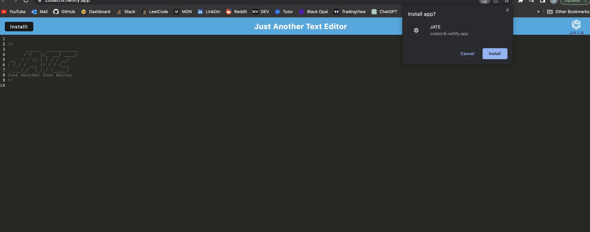

# CodeCrate
CodeCr8 is Just Another Text Editor. 
## User Story

```md
AS A developer
I WANT to create notes or code snippets with or without an internet connection
SO THAT I can reliably retrieve them for later use

```

## Acceptance Criteria

```md
GIVEN a text editor web application
WHEN I open my application in my editor
THEN I should see a client server folder structure
WHEN I run `npm run start` from the root directory
THEN I find that my application should start up the backend and serve the client
WHEN I run the text editor application from my terminal
THEN I find that my JavaScript files have been bundled using webpack
WHEN I run my webpack plugins
THEN I find that I have a generated HTML file, service worker, and a manifest file
WHEN I use next-gen JavaScript in my application
THEN I find that the text editor still functions in the browser without errors
WHEN I open the text editor
THEN I find that IndexedDB has immediately created a database storage
WHEN I enter content and subsequently click off of the DOM window
THEN I find that the content in the text editor has been saved with IndexedDB
WHEN I reopen the text editor after closing it
THEN I find that the content in the text editor has been retrieved from our IndexedDB
WHEN I click on the Install button
THEN I download my web application as an icon on my desktop
WHEN I load my web application
THEN I should have a registered service worker using workbox
WHEN I register a service worker
THEN I should have my static assets pre cached upon loading along with subsequent pages and static assets
WHEN I deploy to Heroku
THEN I should have proper build scripts for a webpack application
```

## Installation

To install head to the following website and hit install! Alternitavely you can use CodeCr8 straight from the browser!

https://codecr8.netlify.app/
## Demo



## Code Snippets

### Manifest

```js
new WebpackPwaManifest({ // Generates a manifest file for Progressive Web Apps
        name: "JATE", // The name of the app
        short_name: "JATE", // A short name for the app
        description: "Just Another Text Editor!", // A description of the app
        background_color: "#225ca3", // The background color of the app
        theme_color: "#225ca3", // The color theme of the app
        publicPath: "./",
        start_url: "./", // The URL to open when the app is launched
        icons: [ // An array of icon objects
          {
            src: path.resolve("src/images/logo.png"), // The path to the icon file
            sizes: [96, 128, 192, 256, 384, 512], // The sizes of the icon file to generate
            destination: path.join("assets", "icons"), // The directory to output the icon files
          },
        ],
})

```

### IndexDB GET Function

```js
// GET function to retrieve all data from the database
export const getDb = async () => {
  console.log("Getting data from the jateDB");
  // Connect to the database
  const jateDb = await openDB("jate", 1);
  // Create a new transaction with read-only privileges
  const tx = jateDb.transaction("jate", "readonly");
  // Open the object store
  const objStore = tx.objectStore("jate");
  // Use the .getAll() method to retrieve all content from the object store
  const req = objStore.getAll();
  // Wait for the request to complete and log the result
  const res = await req;
  console.log("data retrieved from the jateDB", res);
};
```

## License

MIT License

Copyright (c) [2022] [Jorge Zamora]

Permission is hereby granted, free of charge, to any person obtaining a copy
of this software and associated documentation files (the "Software"), to deal
in the Software without restriction, including without limitation the rights
to use, copy, modify, merge, publish, distribute, sublicense, and/or sell
copies of the Software, and to permit persons to whom the Software is
furnished to do so, subject to the following conditions:

The above copyright notice and this permission notice shall be included in all
copies or substantial portions of the Software.

THE SOFTWARE IS PROVIDED "AS IS", WITHOUT WARRANTY OF ANY KIND, EXPRESS OR
IMPLIED, INCLUDING BUT NOT LIMITED TO THE WARRANTIES OF MERCHANTABILITY,
FITNESS FOR A PARTICULAR PURPOSE AND NONINFRINGEMENT. IN NO EVENT SHALL THE
AUTHORS OR COPYRIGHT HOLDERS BE LIABLE FOR ANY CLAIM, DAMAGES OR OTHER
LIABILITY, WHETHER IN AN ACTION OF CONTRACT, TORT OR OTHERWISE, ARISING FROM,
OUT OF OR IN CONNECTION WITH THE SOFTWARE OR THE USE OR OTHER DEALINGS IN THE
SOFTWARE.

## Badges

<a href=”https://www.linkedin.com/in/jorge-zamora-786945250/”>


## Contributing

Pull requests are welcome. For major changes, please open an issue first to discuss what you would like to change. If the issue goes unresolved for more than a week feel free to contact me at any of the links listed below. Be sure to add me on LinkedIn and Follow me on GitHub to view my course progression. 

[](https://github.com/jbxamora) [](https://www.linkedin.com/in/jorge-zamora-786945250//) [](https://www.instagram.com/jbxamora/) [](https://stackoverflow.com/users/20023706/jbxamora)
